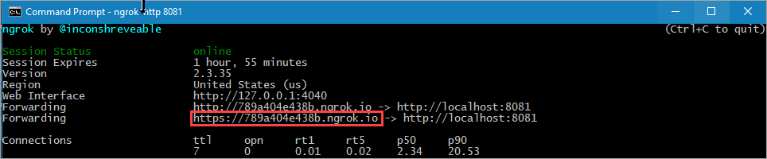

# A guided tour of Microsoft Entra Verified ID - Part 1 Sample

Welcome to the first part of guided tour of Microsoft Entra Verified ID. 

In this part, we'll guide you to issue your first Verifiable Credential (VC): a managed Verified Employee credential. You'll then use this credential to prove to a verifier that you are a Verified Employee of your (fictitious) organization. 

## About the code sample application
The code sample application being leverage is forked from the repo available at [https://github.com/Azure-Samples/active-directory-verifiable-credentials-node](https://github.com/Azure-Samples/active-directory-verifiable-credentials-node). 

**PLEASE REFER TO THESE REPOS FOR THE LATEST AVAILABLE BITS.**

This code sample application is using the Request Service API to both issue and verify Verifiable Employee credentials with a credential contract which allows the REST API to pass in a payload for these credentials.

The endpoint of the API is https://verifiedid.did.msidentity.com/v1.0/verifiableCredentials/createIssuanceRequest and https://verifiedid.did.msidentity.com/v1.0/verifiableCredentials/createPresentationRequest.

Microsoft provides a simple to use REST API to issue and verify verifiable credentials. You can use the programming language you prefer to the REST API. We use here node.js. Instead of needing to understand the different protocols and encryption algorithms for Verifiable Credentials and DIDs you only need to understand how to format a JSON structure as parameter for the VC Request Service API. 

## Issuance

### Issuance JSON structure

To start the issuance process, the Request Service REST API needs a JSON structure payload like below from the code sample application. 

```JSON
{
    "includeQRCode": true,
    "callback": {
      "url": "https://www.litware369.com/api/issuer/issuance-request-callback",
      "state": "you pass your state here to correlate it when you get the callback",
      "headers": {
        "api-key": "API key to help protect your callback API"
      }
    },
    // The authority is the DID from your Microsoft Entra Verified ID service, you can copy this from the Verified Id page in Azure portal
    "authority": "did:ion: ...of the Issuer",
    "registration": {
      "clientName": "Verified Employee Issuer Sample"
    },
    // The type needs to be the same as defined in the Rules description for the managed verified employee. The manifest can be copied 
    // after the credential has been created in the Azure portal
    "type": "your credentialType",
    "manifest": "https://beta.eu.did.msidentity.com/v1.0/abc/verifiableCredential/contracts/Verified employee 1"
}
```

- **includeQRCode** - If you want the Request service REST API to return a `data:image/png;base64` string of the QR code to present in the browser. If you select `false`, you must create the QR code yourself (which is not difficult).
- **callback.url** - a callback endpoint in your (code sample) application. The Request Service API will call this endpoint when the issuance is completed.
- **callback.state** - A state value you provide so you can correlate this request when you get callback confirmation
- **callback.headers** - Any HTTP Header values that you would like the Request Service API to pass back in the callbacks. Here you could set your own API key, for instance- 
- **authority** - is the DID identifier for your registered Microsoft Entra Verified ID instance from portal.azure.com.
- **registration.clientName** - name of your app which will be shown in the Microsoft Authenticator
- **type** - the name of your credentialType. This value is configured in the rules definition of the managed credentatial.
- **manifest** - url of your manifest for your VC. This comes from your defined managed Verified Employee credential in portal.azure.com

In the response message from the Request Service API, it will include a URL to the request which is hosted at the Microsoft VC request service, which means that once the Microsoft Authenticator has scanned the QR code, it will contact the VC Request service directly and not your application directly. Your application will get a callback from the VC Request service via the callback.

```json
{
    "requestId": "799f23ea-524a-45af-99ad-cf8e5018814e",
    "url": "openid://vc?request_uri=https://beta.eu.did.msidentity.com/v1.0/abc/verifiablecredentials/request/21fd5663-c976-4e57-940f-9305b3b8958f",
    "expiry": 1622227690,
    "qrCode": "data:image/png;base64,iVBORw0KGgoA<SNIP>"
}
```

### Issuance Callback

In your callback endpoint, you will get a callback with the below message when the QR code is scanned. This callback is typically used to modify the UI, hide the QR code to prevent scanning again and show the pincode to use when the user wants to accept the managed Verified Employee credential.

```JSON
{
  "requestStatus":"request_retrieved",
  "requestId":"9463da82-e397-45b6-a7a2-2c4223b9fdd0",
  "state": "...what you passed as the state value..."
}
```

Once the VC is issued, you get a second callback which contains information if the issuance of the Verified Employee credential to the user was successful or not.

This callback is typically used to notify the user on the issuance website the process is completed and continue with whatever the website needs or wants the user to do.

### Successful Issuance flow response
```JSON
{
  "requestStatus":"issuance_successful",
  "requestId":"9463da82-e397-45b6-a7a2-2c4223b9fdd0",
  "state": "...what you passed as the state value..."
}
```
### Unuccessful Issuance flow response
```JSON
{
  "requestStatus":"issuance_failed",
  "requestId":"9463da82-e397-45b6-a7a2-2c4223b9fdd0", 
  "state": "...what you passed as the state value...",
  "error": {
      "code":"IssuanceFlowFailed",
      "message":"issuance_service_error",
    }
}
```
When the issuance fails this can be caused by several reasons. The following details are currently provided in the error part of the response:

| Message | Definition |
|---|---|
| fetch_contract_error | The user has canceled the flow |
| issuance_service_error | VC Issuance service was not able to validate requirements / something went wrong on Microsoft AAD VC Issuance service side. |
| unspecified_error | Something went wrong that doesn't fall into this bucket |


## Verification

### Verification JSON structure

To call the Request Service API to start the verification process, the application creates a JSON structure like below. Since the WebApp asks the user to present a VC, the request is also called `presentation request`.

```JSON
{
  "authority": "did:ion: ...of the Verifier",
  "includeQRCode": true,
  "registration": {
    "clientName": "Verified Employee Verifier Sample",
    "purpose": "the purpose why the verifier asks for a VC"
  },
  "callback": {
    "url": "https://www.litware369.com/api/verifier/presentationCallback",
    "state": "you pass your state here to correlate it when you get the callback",
    "headers": {
        "api-key": "API key to help protect your callback API"
    }
  },
  "includeReceipt": false,
  "requestedCredentials": [
    {
      "type": "your credentialType",
      "purpose": "the purpose why the verifier asks for a VC",
      "acceptedIssuers": [ "did:ion: ...of the Issuer" ]
    }
  ],
  "configuration": {
    "validation": {
      "allowRevoked": true,
      "validateLinkedDomain": true
    }
  }
}
```

Much of the data is the same in this JSON structure, but some differences needs explaining.

- **authority** vs **acceptedIssuers** - The Verifier and the Issuer may be two different entities. For example, the Verifier might be a online service, like a car rental service, while the DID it is asking for is the issuing entity for drivers licenses. Note that `acceptedIssuers` is a collection of DIDs, which means you can ask for multiple VCs from the user coming from different trusted issuers.
- **requestedCredentials** - please also note that the `requestedCredentials` is a collection too, which means you can ask to create a presentation request that contains multiple DIDs.
- **includeReceipt** - if set to true, the `presentation_verified` callback will contain the `receipt` element.

### Verification Callback

In your callback endpoint, you will get a callback with the below message when the QR code is scanned.

When the QR code is scanned, you get a short callback like this.
```JSON
{
  "requestStatus":"request_retrieved",
  "requestId":"c18d8035-3fc8-4c27-a5db-9801e6232569", 
  "state": "...what you passed as the state value..."
}
```

Once the VC is verified, you get a second, more complete, callback which contains all the details on what whas presented by the user.

```JSON
{
    "requestStatus":"presentation_verified",
    "requestId":"c18d8035-3fc8-4c27-a5db-9801e6232569",
    "state": "...what you passed as the state value...",
    "subject": "did:ion: ... of the VC holder...",
    "issuers": [
      {
        "authority": "did:ion of the issuer of this verifiable credential ",
        "type": [ "VerifiableCredential", "your credentialType" ],
        "claims": {
            "displayName":"John Doe",
            "givenName":"Doe",
            "jobTitle":"Verfiable Credential Expert"
            // ... 
        },
        "credentialState": {
          "revocationStatus": "VALID"
        },
        "domainValidation": {
          "url": "https://wwww.litware369.com"
        }        
      }
    ],
    "receipt":{
        "id_token": "...JWT Token of VC...",
        "vp_token": "...JWT Token of VP..."
        }
    }
}
```
Some notable attributes in the message:
- **claims** - parsed claims from the VC.
- **credentialState.revocationStatus** - indicates the current revocation status at the time of the presentaion.
- **domainValidation** - If you asked for domain validation via passing validateLinkedDomain true in the request, you will get the validated domain name in the response.
- **receipt.id_token** - The ID token of the presentation, this is the full presentation Authenticator has sent to the Request service. Great for debugging and also to retrieve information not available in the payload. To keep the responses small the receipt property in the request should be set to false.
- **receipt.vp_token** - The JWT token of the credential in the presentation response. In the token, the vp.verifiableCredential contains the VCs for the presented credentials.

## Content

The project is divided in 2 parts, one for issuance and one for verifying a verifiable credential. Depending on the scenario you need you can remove 1 part. To verify if your environment is completely working you can use both parts to issue a managed Verified Employee credential and verify that as well.

| Issuance | |
|------|--------|
| public\issuer.html|The basic webpage containing the javascript to call the Request Service API for issuance. |
| issuer.js | This is the file which implements express routes which contains the API called from the webpage. It calls the Request Service REST API after getting an access token through MSAL. |
| issuance_request_config.json | The sample payload send to the server to start issuing a VC. |

| Verification | |
|------|--------|
| public\verifier.html | The website acting as the verifier of the verifiable credential.
| verifier.js | This is the file which implements express routes which contains the API called from the webpage. It calls the Request Service REST API after getting an access token through MSAL and helps verifying the presented verifiable credential.
| presentation_request_config.json | The sample payload send to the server to start issuing a VC.

## Setup

Before you can run this sample make sure your environment is setup correctly, follow the instructions in the guide "A guided tour of Microsoft Entra Verified ID - Part 1 - A first walkthrough to illustrate how to get started with verifiable credentials in your Azure Active Directory (Azure AD) tenant"? You can alternatively refer to the documentation [here](https://aka.ms/vcsample).

## Setting up and running the code sample application
To run the code sample application, clone the repository, compile & run it. It's callback endpoint must be publically reachable, and for that reason, use `ngrok` as a reverse proxy to reach your app.

```Powershell
git clone https://github.com/philber/entra-verifiedid-tour.git
cd entra-verifiedid-tour\part-1
```

### Create your managed Verified Employee credential
To use the sample we need a configured managed Verified Employee credentail in the Azure portal.

If you navigate to your [Verified ID|Credentials](https://portal.azure.com/#view/Microsoft_AAD_DecentralizedIdentity/InitialMenuBlade/~/cardsListBlade) blade in Azure portal, follow the instructions how to create your first Verified Employee credential.

You can find the instructions on how to create a managed Verified Employee credential in the Azure portal [here](https://aka.ms/didfordev)

Make sure you copy the value of the credential URL after you created the credential in the portal. 
Copy the URL in the `CredentialManifest` part of the `config.json`. 
You need to manually copy your Microsoft Entra Verified ID service created Decentralized Identifier (did:ion..) value from this page as well and paste that in the config.json file for `IssuerAuthority` and `VerifierAuthority`.

### API Payloads
The API is called with special payloads for issuing and verifying verifiable credentials. The sample payload files are modified by the sample code by copying the correct values defined in the `config.json` file.
If you want to modify the payloads `issuance_request_config.json` and `presentation_request_config.json` files yourself, make sure you comment out the code overwriting the values in the issuer.js and verifier.js files. The code overwrites the Authority, Manifest and trustedIssuers values. The callback URI is modified in code to match your hostname.

The file [run.cmd](run.cmd) is a template for passing the correct variables and run your node.js code sample application.

## Running the code sample application

In order to build & run the code sample application, you need to have the [node](https://nodejs.org/en/download/) installed locally. 

1. After you have edited the file [config.json](config.json), start the node app by running this in the command prompt
```Powershell
npm install
.\run.cmd
```

1. Using a different command prompt, run ngrok to set up a URL on 8080. You can install ngrok globally from this [link](https://ngrok.com/download).
```Powershell
ngrok http 8080
```
1. Open the HTTPS URL generated by ngrok.

The sample dynamically copies the hostname to be part of the callback URL, this way the VC Request service can reach your code sample application to execute the callback method.

1. Select GET CREDENTIAL

1. In Authenticator, scan the QR code. 
> If this is the first time you are using Verified ID the Credentials page with the Scan QR button is hidden. You can use the `add account` button. Select `other` and scan the QR code, this will enable the Verifiable Credentials in Authenticator.
6. If you see the 'This app or website may be risky screen', select **Advanced**.
1. On the next **This app or website may be risky** screen, select **Proceed anyways (unsafe)**.
1. On the Add a credential screen, notice that:

  - At the top of the screen, you can see a red **Not verified** message.
  - The credential is based on the information you uploaded as the display file.

9. Select **Add**.

## Verify the verifiable credential by using the code sample application
1. Navigate back and click on the Verify Credential link
2. Click Verify Credential button
3. Scan the QR code
4. select the VerifiedCredentialExpert credential and click allow
5. You should see the result presented on the screen.

## About the code
Since the Request Service API is a multi-tenant API it needs to receive an access token when it's called. 

To get such an access token we are using MSAL as library. MSAL supports the creation and caching of access token which are used when calling Azure Active Directory protected resources like the above Request Service API.

Typical calling the library looks something like this:
```JavaScript
var accessToken = "";
try {
  const result = await mainApp.msalCca.acquireTokenByClientCredential(mainApp.msalClientCredentialRequest);
  if ( result ) {
    accessToken = result.accessToken;
  }
} catch {
    console.log( "failed to get access token" );
    res.status(401).json({
      'error': 'Could not acquire credentials to access your Azure Key Vault'
      });  
    return; 
}
```
And creating an access token:
```JavaScript
const msalConfig = {
  auth: {
      clientId: config.azClientId,
      authority: `https://login.microsoftonline.com/${config.azTenantId}`,
      clientSecret: config.azClientSecret,
  },
  system: {
      loggerOptions: {
          loggerCallback(loglevel, message, containsPii) {
              console.log(message);
          },
          piiLoggingEnabled: false,
          logLevel: msal.LogLevel.Verbose,
      }
  }
};
const cca = new msal.ConfidentialClientApplication(msalConfig);
const msalClientCredentialRequest = {
  scopes: ["3db474b9-6a0c-4840-96ac-1fceb342124f/.default"],
  skipCache: false, 
};
```
> **Important**: At this moment the scope needs to be: **3db474b9-6a0c-4840-96ac-1fceb342124f/.default** This might change in the future

Calling the API looks like this:
```JavaScript
var payload = JSON.stringify(issuanceConfig);
console.log( payload );
const fetchOptions = {
  method: 'POST',
  body: payload,
  headers: {
    'Content-Type': 'application/json',
    'Content-Length': payload.length.toString(),
    'Authorization': `Bearer ${accessToken}`
  }
};
var client_api_request_endpoint = `https://verifiedid.did.msidentity.com/v1.0/verifiableCredentials/createIssuanceRequest`;
const response = await fetch(client_api_request_endpoint, fetchOptions);
var resp = await response.json()
```

## Deploying the code sample application to Azure AppServices
If you deploy the sample to **Azure AppServices**, as an alternative to using [ngrok](https://docs.microsoft.com/en-us/azure/active-directory/verifiable-credentials/verifiable-credentials-faq#i-can-not-use-ngrok-what-do-i-do), you need to update the files `config.json`, `issuance_request_config.json` and `presentation_request_config.json` with your changes before you do **Deploy To Web App** in VSCode. After you have deployed your code sample application, AppServices starts it via invoking the `npm start` command, which means if those files contain the right settings, your app will start successfully. When you create an Azure AppService instance, you should select **Runtime stack** = `Node` and **OS** = `Linux` and select the same region that you have your Azure KeyVault deployed to.

**package.json**
```json
  ...
  "scripts": {
    "start": "node app.js ./config.json ./issuance_request_config.json ./presentation_request_config.json",
  ...
```

If the app doesn't start, if you view the logs in AppServices LogStream, you may see the problem. See [docs](https://docs.microsoft.com/en-us/azure/app-service/configure-language-python#customize-build-automation).

### Understanding what's going on
As a first source of information, the Node sample will trace output into the console window of all HTTP calls it receives. Then a good tip is to use Edge/Chrome/Firefox dev tools functionality found under F12 and watch the Network tab for traffic going from the browser to the Node app.

## Best practices
When deploying applications which need client credentials and use secrets or certificates the more secure practice is to use certificates. If you are hosting your application on azure make sure you check how to deploy managed identities. This takes away the management and risks of secrets in your application.
You can find more information here:
- [Integrate a daemon app with Key Vault and MSI](https://github.com/Azure-Samples/active-directory-dotnetcore-daemon-v2/tree/master/3-Using-KeyVault)

## Resources

For more information, see MSAL.NET's conceptual documentation:
- [Configure your tenant for Microsoft Entra Verified ID](https://aka.ms/vcsetup)
- [Quickstart: Register an application with the Microsoft identity platform](https://docs.microsoft.com/azure/active-directory/develop/quickstart-register-app)
- [Quickstart: Configure a client application to access web APIs](https://docs.microsoft.com/azure/active-directory/develop/quickstart-configure-app-access-web-apis)
- [Acquiring a token for an application with client credential flows](https://aka.ms/msal-net-client-credentials)