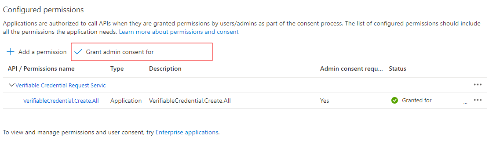

# A guided tour of Microsoft Entra Verified ID - Part 3 Sample

This code sample application demonstrates how to use Microsoft Entra Verified ID to issue and consume managed Custom Credentials for use with Azure AD B2C. 

## About this code sample application

Welcome to the guided tour of Microsoft Entra Verified ID. In this code sample application in ASP.Net Core, we'll teach you to issue Custom Credential to your B2C users once they signed up. You'll then use this card to prove that you are a verified customer of your (fictitious) organization during signin with B2C policies. The code sample application uses the Request Service API which supports ID Token to pass a payload for the verifiable credential.

It is designed to work together with Azure AD B2C in order to have Verifiable Credentials for B2C accounts. Even though you could use it for testing generic VC contracts, like the VerifiedEmployee resp. the CustomCredentialTest VC in the firt part resp. the second part of this guide, you should use it when integrating with the provided Azure AD B2C custom policies that exists in this repo.

## Azure AD B2C and Verifiable Credentials working together - how does it work?

This code sample application uses two general areas to form the end-to-end solution. One is the [custom html](https://docs.microsoft.com/en-us/azure/active-directory-b2c/customize-ui-with-html?pivots=b2c-custom-policy) 
and self asserted pages in Azure AD B2C and the other is the [REST API Technical Profile](https://docs.microsoft.com/en-us/azure/active-directory-b2c/restful-technical-profile) in Azure AD B2C. 

The custom html makes it possible to do ajax calls in javascript to generate the QR code. The REST API makes it possible to integrate calls to the VC sample code so that B2C can send claims and query presentation status.
For this to work, you need this code sample application as a backend for B2C to talk to.

## Contents

As before with the NodeJS project in the first and second parts of this guide, the ASP.NET Core project is divided in 2 parts, one for issuance and one for verifying a Custom Credential for B2C use. Depending on the scenario you need you can remove 1 part. To verify if your environment is completely working you can use both parts to issue a CustomCredentialB2C VC and verify that as well.

| Issuance | |
|------|--------|
| wwwroot/issuer.html|The basic webpage containing the javascript to call the APIs for issuance. |
| ApiIssuerController.cs | This is the controller which contains the API called from the webpage. It calls the Request Service REST API after getting an access token through MSAL. |
| issuance_request_config.json | The sample payload send to the server to start issuing a vc. |

| Verification | |
|------|--------|
| wwwroot/verifier.html | The basic webpage acting as the verifier of the verifiable credential.
| ApiVerifierController.cs | This is the controller which contains the API called from the webpage. It calls the Request Service REST API after getting an access token through MSAL and helps verifying the presented verifiable credential.
| presentation_request_config.json | The sample payload send to the server to start issuing a vc.

## Setup

Before you can run this code sample application make sure your environment is setup correctly, follow the instructions in the documentation [here](https://aka.ms/vcsample).

### create application registration
Run the [Configure.PS1](./AppCreationScripts/AppCreationScripts.md) powershell script in the AppCreationScripts directory or follow these manual steps to create an application registrations, give the application the correct permissions so it can access the Verifiable Credentials Request REST API:

Register an application in Azure Active Directory: 
1. Sign in to the Azure portal using either a work or school account or a personal Microsoft account.
2. Navigate to the Microsoft identity platform for developers App registrations page.
3.	Select New registration
    -  In the Name section, enter a meaningful application name for your issuance and/or verification application
    - In the supported account types section, select Accounts in this organizational directory only ({tenant name})
    - Select Register to create the application
4.	On the app overview page, find the Application (client) ID value and Directory (tenant) ID and record it for later.
5.	From the Certificates & secrets page, in the Client secrets section, choose New client secret:
    - Type a key description (for instance app secret)
    - Select a key duration.
    - When you press the Add button, the key value will be displayed, copy and save the value in a safe location.
    - You’ll need this key later to configure the sample application. This key value will not be displayed again, nor retrievable by any other means, so record it as soon as it is visible from the Azure portal.
6.	In the list of pages for the app, select API permissions
    - Click the Add a permission button
    - Search for APIs in my organization for 3db474b9-6a0c-4840-96ac-1fceb342124f or Verifiable Credential and click the “Verifiable Credentials Service Request”
    - Click the “Application Permission” and expand “VerifiableCredential.Create.All”
    - Click Grant admin consent for {tenant name} on top of the API/Permission list and click YES. This allows the application to get the correct permissions


## Setting up and running the sample
To run the sample, clone the repository, compile & run it. It's callback endpoint must be publically reachable, and for that reason, use a tool like `ngrok` as a reverse proxy to reach your app.

```Powershell
git clone https://github.com/philber/entra-verifiedid-tour.git
cd part-3
```

### Create your Custom Credential
To use the code sample application we need a configured managed Custom Credential in the azure portal.
In the project directory CredentialFiles you will find the `CustomCredentialsB2CDisplay.json` file and the `CustomCredentialsB2CRules.json` file. Use these 2 files to set the releated Display abd Rules definitions fior your own CustomCredentialTest credential. 

If you navigate to your [Verified ID|Credentials](https://portal.azure.com/#view/Microsoft_AAD_DecentralizedIdentity/InitialMenuBlade/~/cardsListBlade) blade in azure portal, follow the instructions how to create your first verifiable credential.

You can find the instructions on how to create a managed Custom Credential in the azure portal [here](https://aka.ms/didfordev)

Make sure you copy the value of the credential URL after you created the credential in the portal. 
Copy the URL in the `CredentialManifest` part of the [appsettings.json](appsettings.json). See below.
You need to manually copy your Microsoft Entra Verified ID service created Decentralized Identifier (did:..) value from this page as well and paste that in the appsettings.json file for `IssuerAuthority`. See below.

### Updating appsettings.json config file

This code sample application in ASP.NET Core has all its configuration in the [appsettings.json](appsettings.json) file and you need to update it before you run the app.

In the [appsettings.json](appsettings.json) file, there are a few settings, but the ones listed below needs your attention.
First, `TenantId`, `ClientId` and `ClientSecret` are used to acquire an `access_token` so you can authorize the VC Client API to your Azure Key Vault.

The remaining five settings control what VC credential you want to issue and present. 

```JSON
    "ApiEndpoint": "https://beta.eu.did.msidentity.com/v1.0/{0}/verifiablecredentials/request",
    "Authority": "https://login.microsoftonline.com/{0}",
    "scope": "3db474b9-6a0c-4840-96ac-1fceb342124f/.default",
    "TenantId": "<your-AAD-tenant-for-VC>",    
    "ClientId": "<your-clientid-with-API-Permissions->",
    "ClientSecret": "your-secret",
    "ApiKey": "",
    "CookieKey": "state",
    "CookieExpiresInSeconds": 7200,
    "CacheExpiresInSeconds": 300,
    "client_name": "Custom Credential for B2C Issuer and Verifier",
    "Purpose": "To prove your identity",
    "VerifierAuthority": "did:ion:...your DID...",
    "IssuerAuthority": "did:ion:...your DID...",
    "CredentialType": "CustomCredentialB2C",
    "DidManifest": "https://beta.eu.did.msidentity.com/v1.0/<your-tenant-id-for-VC>/verifiableCredential/contracts/<your-name>",
    "IssuancePinCodeLength": 0,
    "B2C1ARestApiKey": "your-b2c-app-key 
```
- **ApiEndpoint** - If you have an EU Azure AD tenant, then it should read `beta.eu.did`. If not, then remove `.eu.`
- **TenantId** - This is the Azure AD tenant that you have setup Verifiable Credentials in. It is not the B2C tenant.
- **ClientId** - This is the App you have registered that has the VC permission `VerifiableCredential.Create.All` and that has access to your VC Azure KeyVault.
- **VerifierAuthority** - This DID for your Azure AD tenant. You can find in your VC blade in portal.azure.com.
- **IssuerAuthority** - This DID for your Azure AD tenant. You can find in your VC blade in portal.azure.com.
- **CredentialType** - Whatever you have as type in the Rules file(s). The default is `CustomCrdentialB2C`.
- **DidManifest**- The complete url to the DID manifest. It is used to set the attribute `manifest` and it is used for both issuance and presentation.
- **IssuancePinCodeLength** - If you want your issuance process to use the pin code method, you specify how many digits the pin code should have. A value of zero will not use the pin code method.
- **B2C1ARestApiKey**: This is the value of your API key 

### API Payloads
The API is called with special payloads for issuing and verifying Custom Credentials. The sample payload files are modified by the sample code by copying the correct values from the `appsettings.json` file.
If you want to modify the payloads `issuance_request_config.json` and `presentation_request_config.json` files yourself, make sure you comment out the code overwriting the values in the ApiVerifierController.cs and ApiIssuerController.cs files. The code overwrites the Authority, Manifest and trustedIssuers values. The callback URI is modified in code to match your hostname.

For issuance you don't need to change anything, for verifying make sure you follow the provided instructions and copy paste the correct payload to the `presentation_request_config.json`

Make sure you copy the `ClientId`, `ClientSecret` and `TenantTd` you copied when creating the app registration to the `appsettings.json` as well.

## Running the code sample application along with the Azure AD B2C custom policies

### Standalone
To run the code sample application standalone, just compile & run it. It's callback endpoint must be publically reachable, and for that reason, use `ngrok` as a reverse proxy to read your application.

In order to compile & run the code, you need to have the [dotnet core runtime](https://dotnet.microsoft.com/en-us/download/dotnet) installed locally. 

1. Open a command prompt and run the following commands:
```Powershell
dotnet build "AspNetCoreVerifiableCredentialsB2Cdotnet.csproj" -c Debug -o .\bin\Debug\netcoreapp3.1
dotnet run
```
2. Using a different command prompt, run ngrok to set up a URL on 5002. You can install ngrok globally by using the [ngrok npm package](https://www.npmjs.com/package/ngrok/).
```Powershell
ngrok http 5002
```
3. Open the HTTPS URL generated by ngrok (like `https://df4a-256-714-401-356.ngrok.io`).
The code sample application dynamically copies the hostname to be part of the callback URL, this way the VC Request service can reach your sample web application to execute the callback method.

Once you have the code sample application working, and you can issue and verify the sample credential.

**Note that the issuer test page is there just to help you do the basic issuance testing. Issuing VCs with this code sample application is intended to be done via the Azure AD B2C signup custom policies.**

To issue the VC;
1. Select Issue Credential.
2. In Authenticator, scan the QR code. 
> If this is the first time you are using Verifiable Credentials the Credentials page with the Scan QR button is hidden. You can use the `add account` button. Select `other` and scan the QR code, this will enable the Verifiable Credentials in Authenticator.
3. If you see the 'This app or website may be risky screen', select **Advanced**.
4. On the next **This app or website may be risky** screen, select **Proceed anyways (unsafe)**.
5. On the Add a credential screen, notice that:
  - At the top of the screen, you can see a red **Not verified** message.
  - The credential is based on the information you uploaded as the display file.
6. Select **Add**.

To verify the VC:
1. Navigate back and click Verify Credential.
3. In Authenticator, scan the QR code.
4. select the CustomCredentialB2C VS and click Share.
5. You should see the result presented on the screen.

### Docker build

To run it locally with Docker
1. Open a command prompt and run the following commands:
```
docker build -t aspnetcoreverifiablecredentialsb2cdotnet:v1.0 .
docker run --rm -it -p 5002:80 aspnetcoreverifiablecredentialsb2cdotnet:v1.0
```
2. Using a different command prompt, run ngrok to set up a URL on 5002:

```Powershell
ngrok http 5002
```
### Together with Azure AD B2C
You follow the instructions in the thrid part of this guide to deploy the provided B2C policies. 
Note that the TrustFrameworkExtensionsVC.xml file references the endpoints to the API facade exposed by the code sample application in several places as they work together.

Once you have the code sample application working, and verified you can issue and verify the sample credential, you can verify that it also will respond to the API that Azure AD B2C will call. To do this, you need the `id` (guid) that is unique for the browser session. You can either find it in the trace output in the console window of the running sample app, or you can find it in the browsers developer console (F12 in Edge/Chrome, then Console) _after_ you have completed a verification in the browser. 

To test the B2C API, run the below in a powershell prompt (change the `$id` and `$ngrokUrl` values first).

```powershell
$id="2fb8dce0-9d69-481a-8a2b-f64b684a8aae"
$ngrokUrl="https://df4a-256-714-401-356.ngrok.io"
$response = Invoke-WebRequest -Uri "$ngrokUrl/api/verifier/presentation-response-b2c" `
                              -Method Post -Body (@{id=$id;}|ConvertTo-json) -ContentType "application/json"
$response.Content | ConvertFrom-json
```
When you have the Azure AD B2C custom policies deployed, the steps to test is to:
1. Run the B2C policy `B2C_1A_VC_susiq` (SignupOrSigninVCQ.xml) and signup a new user. After you have validated the email, set the password, etc, the final step in the B2C user journey is to issue the new user with a VC.
2. Run the B2C policy `B2C_1A_signin_VC` (SigninVC.xml) to sign in your B2C user via presenting the VC.

### LogLevel Trace

If you set the LogLevel to `Trace` in the appsettings.json file, then the DotNet sample will output all HTTP requests, which will make it convenient for you to study the interaction between components.

## About the code
Since the API is now a multi-tenant API it needs to receive an access token when it's called. 
The endpoint of the API is https://beta.eu.did.msidentity.com/v1.0/{YOURTENANTID}/verifiablecredentials/request if your tenant is located in Europe. Otherwise it is https://beta.did.msidentity.com/v1.0/{YOURTENANTID}/verifiablecredentials/request 

To get an access token we are using MSAL as library. MSAL supports the creation and caching of access token which are used when calling Azure Active Directory protected resources like the verifiable credential request API.
Typicall calling the libary looks something like this:
```C#
app = ConfidentialClientApplicationBuilder.Create(AppSettings.ClientId)
    .WithClientSecret(AppSettings.ClientSecret)
    .WithAuthority(new Uri(AppSettings.Authority))
    .Build();
```
And creating an access token:
```C#
result = await app.AcquireTokenForClient(scopes)
                  .ExecuteAsync();
```
> **Important**: At this moment the scope needs to be: **3db474b9-6a0c-4840-96ac-1fceb342124f/.default** This might change in the future

Calling the API looks like this:
```C#
HttpClient client = new HttpClient();
var defaultRequestHeaders = client.DefaultRequestHeaders;
defaultRequestHeaders.Authorization = new AuthenticationHeaderValue("Bearer", result.AccessToken);

HttpResponseMessage res = await client.PostAsync(AppSettings.ApiEndpoint, new StringContent(jsonString, Encoding.UTF8, "application/json"));
response = await res.Content.ReadAsStringAsync();
```

## Troubleshooting

### Did you forget to provide admin consent? This is needed for confidential apps.
If you get an error when calling the API `Insufficient privileges to complete the operation.`, this is because the tenant administrator has not granted permissions
to the application. See step 6 of 'Register the client app' above.

You will typically see, on the output window, something like the following:

```Json
Failed to call the Web Api: Forbidden
Content: {
  "error": {
    "code": "Authorization_RequestDenied",
    "message": "Insufficient privileges to complete the operation.",
    "innerError": {
      "request-id": "<a guid>",
      "date": "<date>"
    }
  }
}
```

### Understanding what's going on
As a first source of information, the ASP.NET Core code sample application will trace output into the console window of all HTTP calls it receives. Then a good tip is to use Edge/Chrome/Firefox dev tools functionality found under F12 and watch the Network tab for traffic going from the browser to the Node app.

## Best practices
When deploying applications which need client credentials and use secrets or certificates the more secure practice is to use certificates. If you are hosting your application on azure make sure you check how to deploy managed identities. This takes away the management and risks of secrets in your application.
You can find more information here:
- [Integrate a daemon app with Key Vault and MSI](https://github.com/Azure-Samples/active-directory-dotnetcore-daemon-v2/tree/master/3-Using-KeyVault)

## More information

For more information, see MSAL.NET's conceptual documentation:

- [Quickstart: Register an application with the Microsoft identity platform](https://docs.microsoft.com/azure/active-directory/develop/quickstart-register-app)
- [Quickstart: Configure a client application to access web APIs](https://docs.microsoft.com/azure/active-directory/develop/quickstart-configure-app-access-web-apis)
- [Acquiring a token for an application with client credential flows](https://aka.ms/msal-net-client-credentials)
